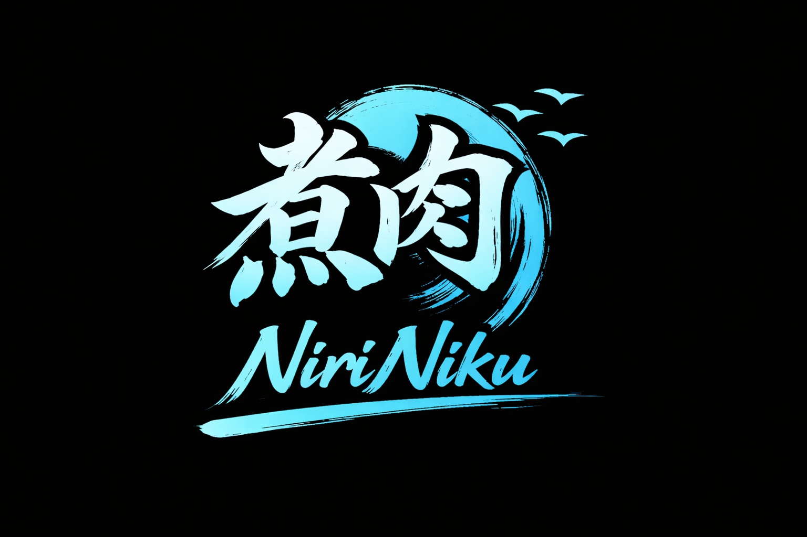
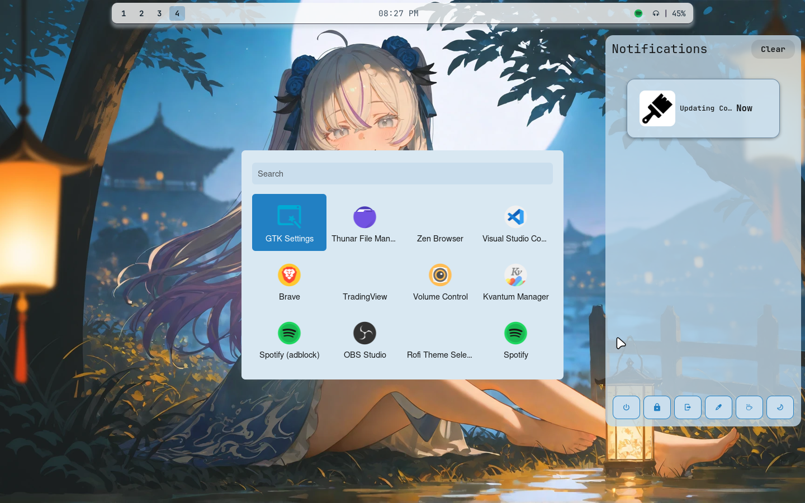
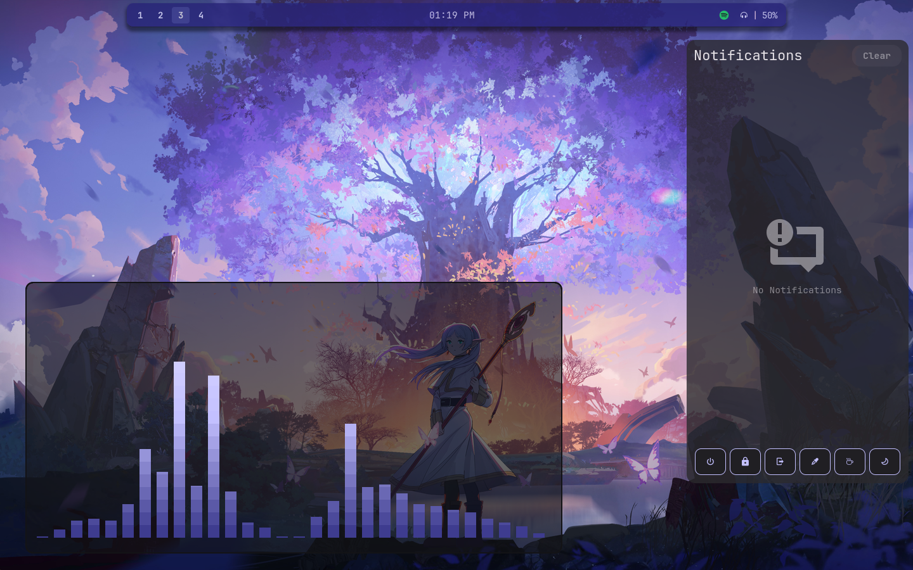
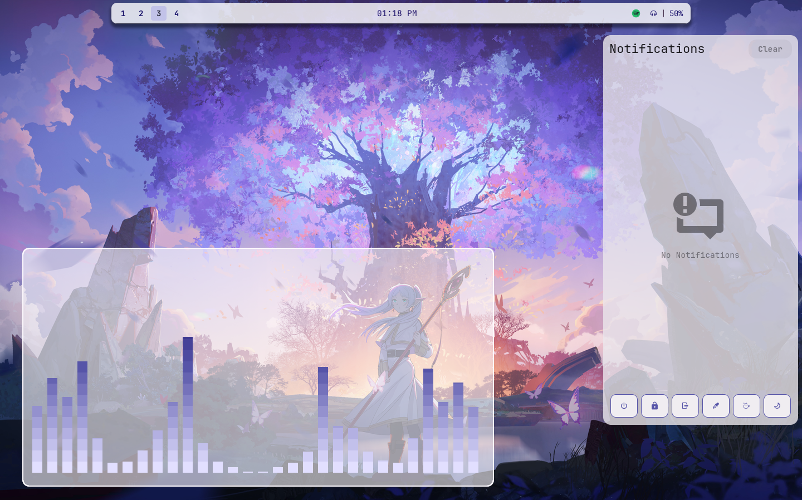
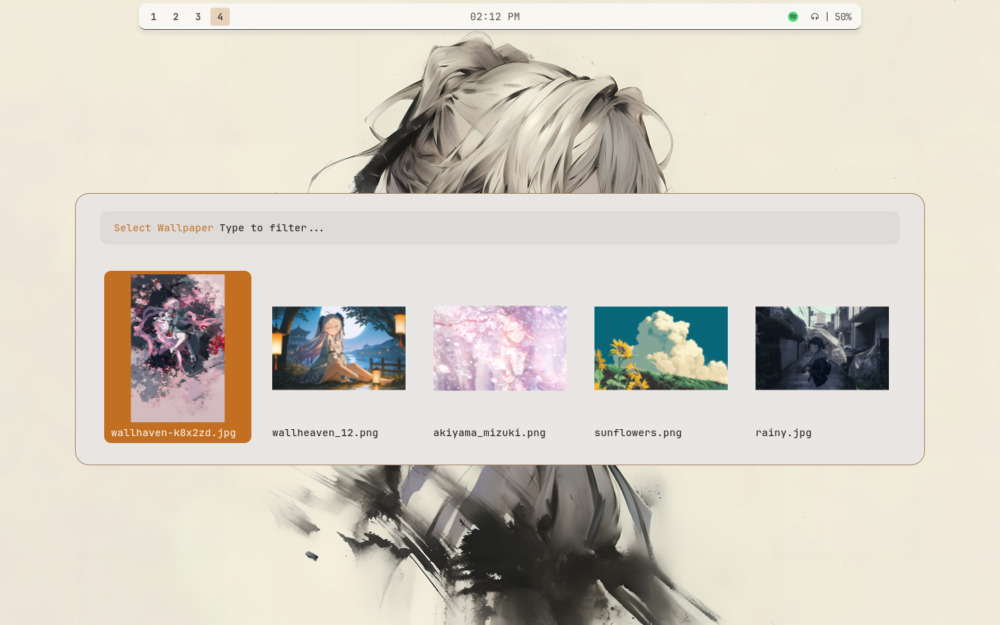
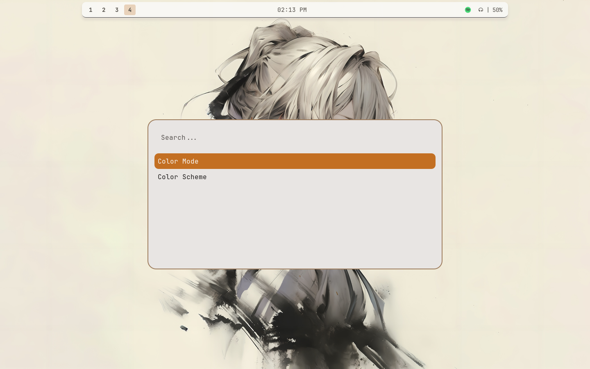
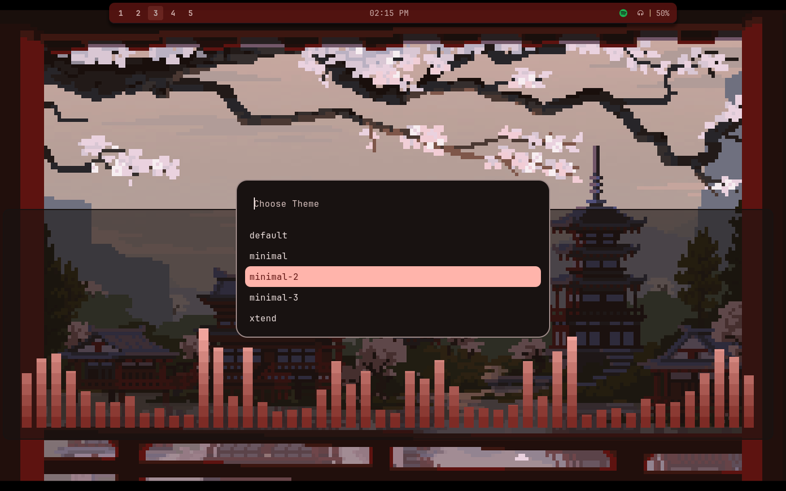

<p align="center">
  
</p>

<p align="center">
  <em>Minimilist, made powerful — a clean Niri setup for Arch Linux</em>
</p>

<p align="center">
  Built with love ❤️ and designed to stay simple, readable, and powerful.
</p>

---

## About

**Niku** is a minimal yet powerful **[Niri](https://github.com/niri-wm/niri) rice** for **Arch Linux**, focused on clarity, aesthetics, and real-world usability.

---
<p align="center">
  <a href="#assets">Assets</a> •
  <a href="#videos">Videos</a> •
  <a href="#installation">Installation</a> •
  <a href="#keybinds">Keybinds</a> •
  <a href="#customize">Customize</a> •
  <a href="#credits">Credits</a>
</p>

---

## Assets

<!-- Hero shots (large) -->
<p align="center">
  
</p>
<p align="center">
  
</p>
<p align="center">
  
</p>
<p align="center">
  
</p>

---

<!-- Gallery (small) -->
<p align="center">
  
  
</p>

<p align="center">
  
  
</p>

<p align="center">
  
  
</p>

<p align="center">
  
  
</p>

<p align="center">
  
  
</p>

<p align="center">
  
  
</p>

<p align="center">
  <em>Minimal • Material You inspired • Workflow focused</em>
</p>

---

## Videos

Some things are better seen in motion.

You can find **Niku video demos**, looks, and workflow showcases on my Reddit profile:

👉 [Reddit](https://www.reddit.com/user/Scary-Combination-67/submitted/)

(New videos will be added as features evolve.)

---

## Features

- 🪟 Niri (Wayland)
- 🎨 Material You colors via `matugen`
- 🧩 GTK: adw-gtk3
- 🖼️ Icons: Papirus
- 🔤 Fonts: NerdFont
- ⚡ Clean, modular dotfiles
- 🧠 Beginner-friendly structure
- 💖 Complete Desktop Environment

---

## 📦 What’s Included

- Niri dotfiles
- GTK & system theming
- Workflow scripts
- One-shot installer (`install.sh`)
- Wallpaper & theme automation

All dependencies and configs are handled **inside the installer**.

---

## Requirements

- Arch Linux / Base Arch install
- git
- Minimal Arch (`optional`)

## Installation

### You have two option for installtion 
 
---

#### Option 1 (recommended)
1. Fork this repository.

2. Then Clone this repository.

```bash
git clone --depth 1 https://github.com/<USER_NAME>/niku.git ~/.niku
```

3. cd into the directory and make the installer executable:

```bash
cd ~/.niku
chmod +x install.sh
```
4. Run the installer:

```bash
./install.sh
```

---


#### Option 2
1. Clone this repository:

```bash
git clone --depth 1 https://github.com/N1XA-CLI/niku.git ~/.niku
cd ~/.niku # Do not delete this folder
rm -rf .git # Remove the .git for Customizing.
```

2. Make the installer executable:

```bash
chmod +x install.sh
```

3. Run the installer:

```bash
./install.sh
```

* Creates a backup of current config (**only config that it creates symlink or copies**).
* It will **check and install missing packages** via `yay`.
* Creates **Symlink** for **Ease**.


4. Restart your session or apps if needed to see theme changes.

---

## Keybinds

```bash
Mod + Enter           # Open Terminal (Kitty)
Mod + Shift + Enter   # Open Floating Terminal (Kitty)
Mod + A               # Application Launcher
Mod + B               # Open Browser (Brave)
Mod + C               # Open Code Editor (Neovim)
Mod + E               # Open File Manager (Yazi)
Mod + N               # Notification Center (Swaync)
Mod + M               # Open Music Player (Spotify)
Mod + Grave           # Keybinds Cheatsheet (Grave below Escape)
Mod + Shift + S       # System Launcher (Quick access to features)
```

---

## Customize

 Customizing is really easy. You just have to edit the files in ```~/.config/```.

---

## DIRECTORIES

```bash
.config/
├── btop            # Resource Manager
├── cava            # Audio Visualiser
├── fastfetch       # System Fetcher
├── fish            # Terminal Shell
├── gtk-3.0         # Gtk-3 Config
├── gtk-4.0         # Gtk-4 Config
├── kitty           # Terminal
├── niku            # Main Config 
├── niri            # Niri Config
├── nvim            # NvChad
├── nwg-look        # Gtk Manager
├── rofi            # Launcher
├── spicetify       # Spotify Customiser
├── swaylock        # Screen Locker
├── swaync          # Notification Center
├── waybar          # Status Bar
├── wlogout         # Powermenu
└── yazi            # File Manager

```

---

## Credits

- [***Shreyas***](https://github.com/shreyas-sha3) the base of the rice
- [***Aadritobasu***](https://github.com/aadritobasu/) for configs.
- [***Noctalia***](https://github.com/noctalia-dev) for Color Scheme and mode generator
---

